# Fraud Detection with Cloudera Stream SQL Builder - SSB

You may have recently heard or read stories on health pass fraud , or carbon credit tax fraud (if you watched “Les Rois de l’arnaque” on Netflix ).Frauds always existed throughout human history and detecting fraudulent transactions in whatever the industries involved is one of the classic use cases but also one of the biggest challenges.

## How is Fraud Detection challenged?

Why is fraud a big deal? Well, it's about losing money. According to link:https://www.ftc.gov/news-events/press-releases/2021/02/new-data-shows-ftc-received-2-2-million-fraud-reports-consumers[the Federal Trade Commission], the estimated loses in business organizations is more than $3.3 billion in 2020, an increase of $1.5 billion since 2019 (before COVID19).
A link:https://www.pwc.com/gx/en/services/forensics/economic-crime-survey.html[PwC Global Economic Crime and Fraud Survey] founds that 47% of the 5500 respondents companies experienced a fraud in the past 24 months and  $42 billion is the total fraud losses reported by these companies.

Although many institutions took measures to counter frauds, fraudulent transactions have been soaring in recent years making fraud prevention one of the hottest topics and top challenges for organizations.

Fraud prevention is most effective when you can act on suspicious transactions in real-time. These curated assets offer insights to help you prevent fraud using real-time data, advanced analytics and machine learning.[1].

Traditionally, fraud prevention applications have been deployed using stream processing (Spark streaming or Kafka Streams) and  need core and strong  skills in programming such as Java or Scala. But not all the organizations are well staffed and this reduces who can access the stream processing framework.
Luckily, Cloudera released SQL Stream Builder (running on Flink, available with the Cloudera Stream Analytics) that allows data analytics teams to easily build robust real-time streaming pipelines. Cloudera Streaming SQL Builder (SSB) helps in democratizing streaming data using the power and the maturity of the SQL language, so now everyone can write stream analytics applications.

## Event-Driven Fraud Prevention with SSB

To get practical, let's see how we can build a real time fraud detection application  with the open source components available in Cloudera Data Platform (CDP) and Cloudera Data Flow (CDF).

All the value of CDP and CDF can be delivered either OnPremise or on Public Cloud. In this article, I will focus on CDP Public Cloud in building our fraud detection application.

The architecture uses:

* *link:https://docs.cloudera.com/cfm/2.1.2/index.html[Cloudera Flow Management -Apache Nifi]* - for data ingestion. Apache Nifi collects in real-time transactional events and sends them to Apache Kafka brokers.

* *link:https://docs.cloudera.com/cdp-private-cloud-base/7.1.7/concepts-streaming.html[Cloudera Streams Messaging -Apache Kafka]* - for stream messaging. Apache Kafka will receive the transactional events from Apache Nifi and store them.

* *link:https://docs.cloudera.com/csa/1.6.0/index.html[Cloudera Streaming analytics -Apache Flink/SSB]* - for data processing.Cloudera offers Cloudera Stream Analytics(CSA) which is essentially *Apache Flink + SQL Stream Builder (SSB)*. Apache Flink offers low-latency processing of unbounded data streams. It connects to different data sources such as Kafka topics providing real-time insights or detecting anomalies in streaming context. Streaming SQL Builder (SSB) provides a SQL layer that allows data analysts to rapidly experiment with streaming data without writing java code. SSB supports different data connectors: Apache Kafka, apache Kudu, apache Hive,Schema Registry.

* *link:https://docs.cloudera.com/cdp-private-cloud-base/7.1.7/kudu-overview/topics/kudu-intro.html[Cloudera Fast Storage Analytics -Apache Kudu]* - for storage of transactional events. Apache Kudu is a distributed, columnar storage, which offers "fast analytics on fast data". Thus, Apache Flink and Apache Kudu make a great match.

* *link:https://docs.cloudera.com/cdp-private-cloud-base/7.1.7/impala-overview/topics/impala-overview.html[Cloudera Data Warehouse -Apache Impala]* - for user query of all transactional events and building BI Dashboards.

* *link:https://docs.cloudera.com/data-visualization/cloud/index.html[Cloudera Data Visualization]* - for quickly explore and get insight across the data lifecycle from data ingestion with Nifi, to data processing with Flink and SSB.

The picture below depicts a high level architecture of an Event Driven Fraud Detection with SSB:

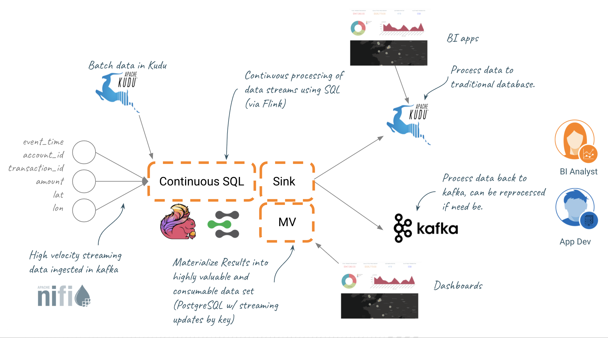

The architecture outlined above describes the implementation solution for fraud detection use cases on Cloudera Data Platform. The solution addresses :

** Generating a fake unbounded timestamped stream of transactional events in JSON.
** Ingesting these events using Apache Nifi and store them in apache Kafka.
** Detect fraudulent transactions using Apache Flink and SSB. To detect a fraudulent transaction, we will implement the following pattern:
* we will consider two transactions with the same "account_id" :
*** Occurring in 2 different locations,
*** With a distance greater than *1 KM*,
*** And with less than 10 minutes between them.
** Enrichment of the detected fraud transactions with some constant metadata stored in an apache  Kudu table called "customers" and write back the full enriched stream into another apache kudu table called "fraudulent_txn".
** SQL Stream Builder offers the capability to materialize results from a Streaming SQL query to a persistent view of the data that can be read through REST. We will leverage the Materialized  View (MV) feature in SSB to expose the fraudulent data to Cloudera Data Visualization.
** Advanced querying of fraudulent transactions with Cloudera data Visualization.

Now, let’s get our hands dirty!

## Infrastructure deployment

As mentioned before, I will deploy our fraud detection use case in CDP Public Cloud.

In CDP Public Cloud, I've created a new environment called "fraud-demo"  and deployed 4 Data Hub :

** Flow Management Data Hub (NIFI) : *fraud-detection-cfm*.
** Streams Messaging Data Hub (KAFKA): *fraud-detection-csm*.
** Streams Analytics Data Hub (FLINK/SSB) : *fraud-detection-csa*.
** Real Time Data Warehouse Data Hub (Impala/Kudu) : *fraud-detection-rtdw*.

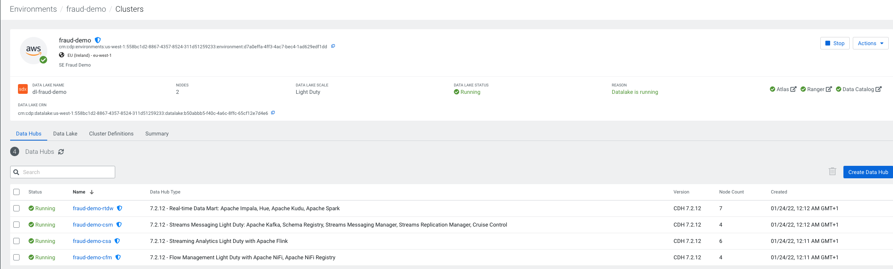

## Data Model

The data model will describe how data is generated and stored. In our fraud detection application, we will consider the following data model :

** *Generating fake financial transactions (Stream Kafka , Kudu table)*

In order to feed up our fraud detection application with financial transactions events, I used an open source tool called link:https://github.com/mapr-demos/gess[gess]. I used the `/gess/scripts/fintrans.py` which I tweaked in order to fit my use case. The modified script is available in  `/Scripts/generate-txn.py`

The script will stream financial transaction data, JSON-formatted via UDP on default port `6900` :

===== *Valid transaction*
[source,textmate]

{
'ts': '2013-11-08T10:58:19.668225',
'account_id': 'a335',
'transaction_id': '636adacc-49d2-11e3-a3d1-a820664821e3'
'amount': 100,
'lat': '36.7220096',
'lon': '-4.4186772'
}

The script will also stream a fraudulent transaction with the  same account ID as the original transaction but with different location and amount. The transaction_id will be prefixed with 'xxx' in order to highlight them easily.

===== *Fraudulent transaction*
[source,textmate]

{
'ts': '2013-11-08T12:28:39.466325',
'account_id': 'a335',
'transaction_id': 'xxx636adacc-49d2-11e3-a3d1-a820664821e3'
'amount': 200,
'lat': '39.5655472',
'lon': '-0.530058'
}

The generated transactional events will be ingested in apache Kafka and in Apache Kudu.

Since we need to ingest these financial transaction events in Apache Kafka, one of the best practices would suggest registering the schema of the incoming events in Schema Registry. Doing so, we will enable our flows in Nifi to refer to this schema using a unified service. Also, it will be easier to evolve or modify the schema in the future. The generated financial transaction data is described by the schema in file  link:Data/02_Schema_Registry_Schema_Name_Fintxn[`/Data/02_Schema_Registry_Schema_Name_Fintxn`]

We need also to create the kudu table `transactions` with the following schema :

[source,sql]
----
create TABLE transactions
(
ts string,
acc_id string,
transaction_id string,
amount bigint,
lat double,
lon double,
PRIMARY KEY (ts, acc_id)
)
PARTITION BY HASH PARTITIONS 16
STORED AS KUDU
TBLPROPERTIES ('kudu.num_tablet_replicas' = '3');
----

** *Generating fake customers data (Kudu Table)*

In our use case, we need to enrich the incoming Apache kafka stream with some metadata information stored in a kudu table called "customers". The "customer" kudu table schema is :

[source,sql]
----
account_id
first_name
last_name
email
gender
phone
card
----

To get  some customer data loaded in the "customer" table, I used an online tool called link:https://www.mockaroo.com/[mockaroo]. The generated csv data can be found in Data folder: link:Data/01_Customer_Data.csv[Customer_Data]

Now, we need to create an Apache Kudu table called "customer" and load the customer csv data in this table.

For that, I'll create first a temporary Impala  table called "customer_temp" and load the csv file from S3:

[source,sql]
----
CREATE external TABLE customer_temp
(
acc_id string,
f_name string,
l_name string,
email string,
gender string,
phone string,
card string)

ROW FORMAT DELIMITED FIELDS TERMINATED BY ","
STORED AS TEXTFILE;

LOAD DATA INPATH 's3a://kdj-demo/my-data/customer-data.csv' INTO TABLE default.customer_temp
----

Then, I'll create my Kudu table "customer" from the previous customer_temp table:

[source,sql]
----
CREATE TABLE customers
PRIMARY KEY (acc_id)
PARTITION BY HASH PARTITIONS 16

STORED AS KUDU
TBLPROPERTIES ('kudu.num_tablet_replicas' = '3')
AS select  acc_id,f_name,l_name,email,gender,phone,card  from customer_temp;
----

** *Fraudulent Transactions enriched (Kudu Table)*

Once we get our fraudulent transactions detected from our stream process application, we need to combine them with master data stored in apache Kudu. Basically we will enrich the events flowing from Apache Kafka cluster with metadata information stored in the "customer" Apache Kudu table and write back the enriched events in another apache kudu table called "fraudulent_txn".The schema of this table is:

[source,sql]
----
event_time
account_id
transaction_id
first_name
last_name
email
gender
phone
card
lat
lon
amount
----

Now, let's create this table in Apache Kudu:

[source,sql]
----
create TABLE fraudulent_txn
(
event_time string,
acc_id string,
transaction_id string,
f_name string,
l_name string,
email string,
gender string,
phone string,
card string,
lat double,
lon double,
amount bigint,
PRIMARY KEY (event_time, acc_id)
)
PARTITION BY HASH PARTITIONS 16
STORED AS KUDU
TBLPROPERTIES ('kudu.num_tablet_replicas' = '3');
----

Well, all our data models are set. Let's see how to build the pipeline of our event streaming fraud detection application on Apache Nifi, Apache Kafka, Flink and SQL Stream Builder with visualization of the results in Cloudera Data Visualization.

## Data Ingestion

First part of our data pipeline is the data ingestion. We will use Nifi to capture the streamed data over UDP and push events to Kafka with a simple flow.

=== Step 1: Registering the schema in Schema Registry

I won't cover all the steps you need to do in order to get the schema registered in Schema Registry. For more details, you can refer to link:https://github.com/cloudera-labs/edge2ai-workshop/blob/trunk/workshop_nifi.adoc[Lab 1] in the Edge2Ai workshop.

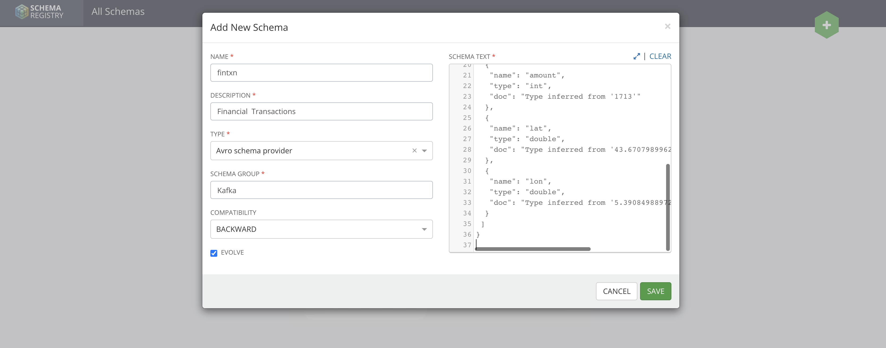

=== Step 2: Configuring the Nifi flow and pushing data to Apache Kafka

We will use Nifi to capture the streamed data over UDP, then we will update the stream with the schema name previously added in the Schema registry, and finally we will push data to the Apache Kafka topic. We will use the following Nifi processors:

** *ListenUDP*
** *UpdateAttribute*
** *PublishKafkaRecord*

We will also need additional controller services in order to get the schema name from SR and also handle the reading and writing of JSON records.

** *HortonworksSchemaRegistry*
** *JsonTreeReader*
** *JsonRecordSetWriter*

I won't  cover all the steps to deploy the Nifi flow and controller services settings. For that, I'll import my flow file definition I've already prepared. You can find this flow file link:Templates/01_Fraud_Detection_Demo.json[here] :  `/Template/01_Fraud_Detection_demo.json` :

. From Nifi GUI, click on Add Process Group:
.
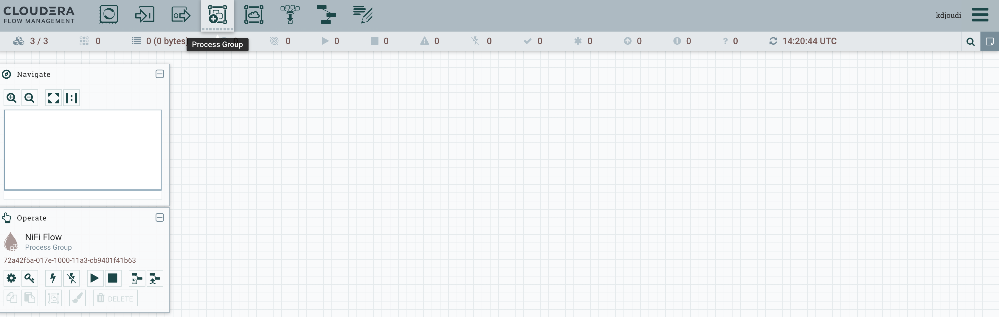

. Then, upload the previous flow file definition:
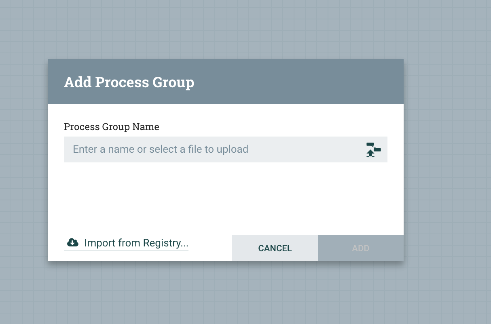

. The below flow captures the event over UDP, attach a schema name `fintxn` to each event, and push it to the `txn1`,`txn2` Kafka topics:
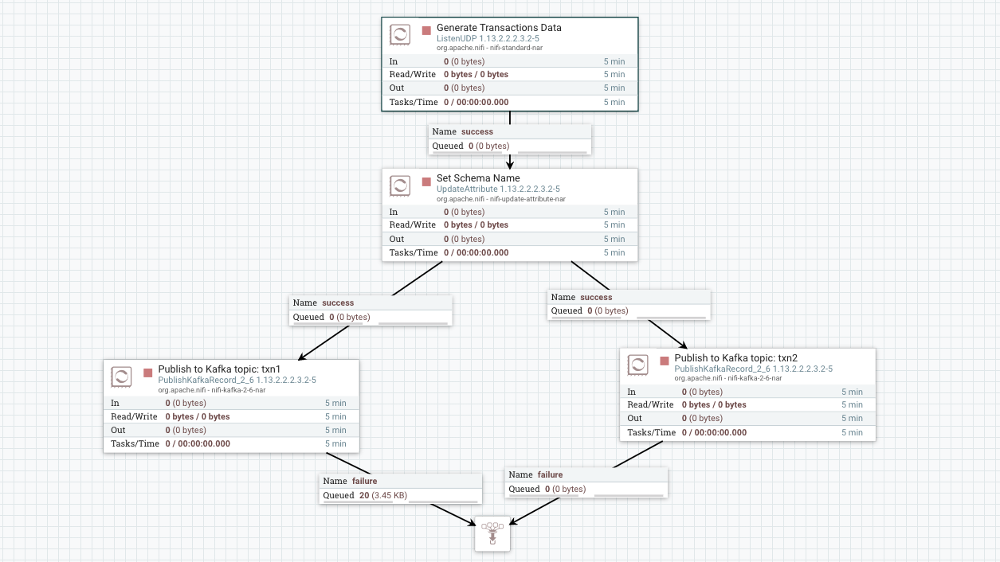

But, before starting our flow ingestion, we need to modify some parameters :

* First, we need to update the HortonworksSchemaRegistry with the correct SR url.

** Make sure that the Schema Registry URL is correct. Use the schema registry hostname + port (use the master endpoint FQDN from `fraud-demo-csm` datahub hardware tab): `https://fraud-demo-csm-master0.fraud-de.a465-9q4k.cloudera.site:7790/api/v1`
** Make sure that the username + password combination is correct in the processor. Use the Workload manager username and password. Since, I'll use my Workload manager password in other nifi processors, I'll leverage a nice feature in Nifi called "Parameters". For that, I created a Process group parameter context in Nifi called `Workloadmanager_pwd`, tagged it as a sensitive value and added my Workload manager password. So, I'll refer to my password in Nifi processors by referencing this parameter : `*#{pwd}*`. This parameter needs to be updated with the corresponding Workload manager password.
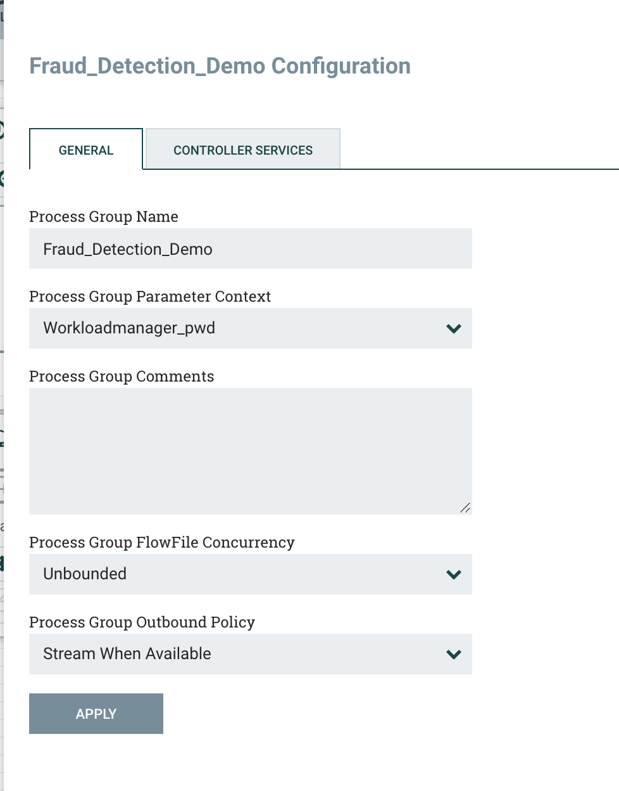

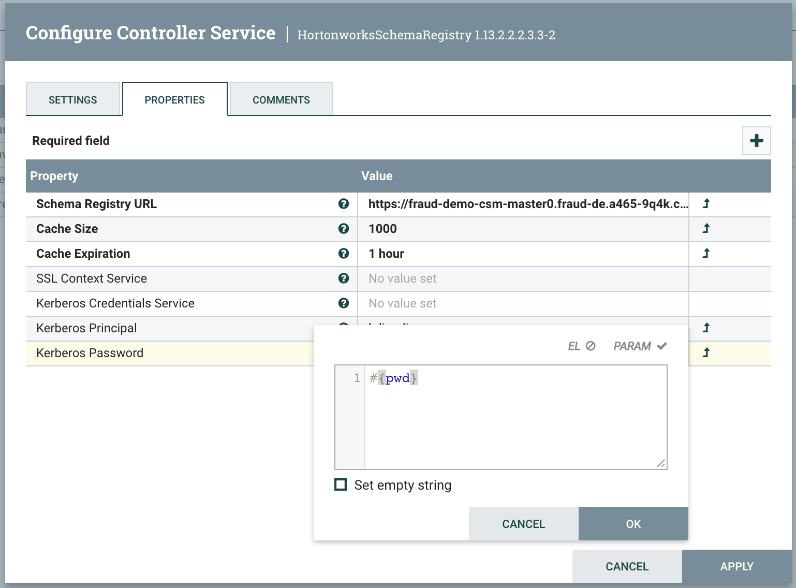

** Make sure to enable all the controller services.
** Make sure you have created a policy in Ranger that allows the users and services to access the schema and tables.
** We need also to update the PublishKafkaRecord with the right Apache Kafka brokers url.
** We need also to update the `02_generate_txn.py` data generator script with the right ip address of the host running the script. In our case, I'm running this script in a Nifi node, I just updated the variable `TARGET_HOST` in the script with the private ip address of my Nifi node and then run the script:

[source,text]
----
[kdjoudi@fraud-detection-cfm-nifi1 ~]$ python3 02_generate_txn.py
----

Now, let's start our Nifi Flow, we can see from SMM that we have messages coming in Apache Kafka:
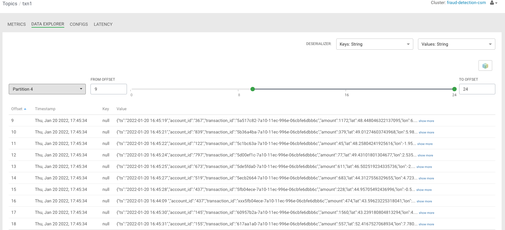

## Data Processing

Well, we are getting our financial transactions in our apache Kafka brokers. So far so good. Now, let's move forward and see how we can implement the fraud detection logic with Flink and SQL Stream Builder (SSB).

As I mentioned before, Cloudera CSA is intended "to empower real-time insights", and it includes Flink and SSB.

All the goodness of Apache Flink : event-driven applications, streaming analytics and continuous data pipelines with high throughput and low latency are offered part of the CSA package.So now, we can write pipelines to ingest data in real-time, materialising these results to database or files, we can also write applications to transform and enrich data while it is being moved from one system to another, and we can also connect Dashboards to consume and visualize all this information.
CSA also includes SSB to allow continuous SQL on unbounded data streams. Basically, it is a SQL interface that allows us to run queries against streams, but also to join them with batch data from other sources, like Apache Hive, apache Impala, apache Kudu or other JDBC connections.

More details about Cloudera Stream Analytics(CSA) can be found on link:https://docs.cloudera.com/csa/1.6.1/index.html[the documentation].

### Setting up the sources

Returning to the case study at hand, we need to set up the sources and data catalogs in the Data provider section  from Streaming SQL Console (remember to unlock your keytab when connecting first time  to SSB Console):

** Adding the Apache Kafka broker.
** Adding the Schema Registry catalog
** Adding the Kudu catalog.

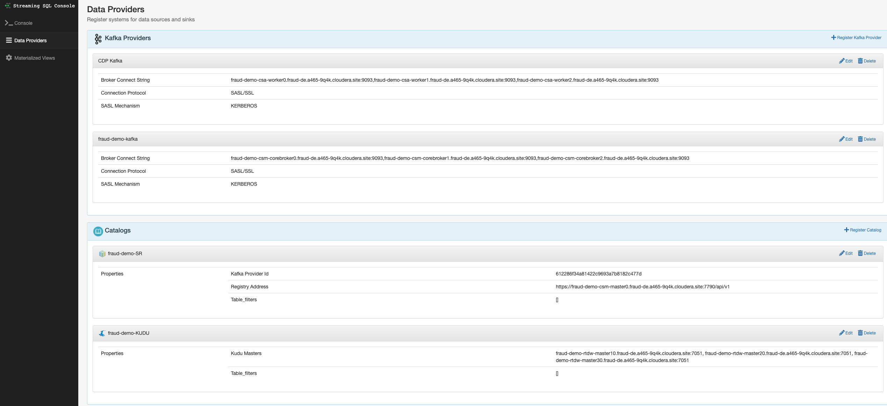

### Setting up the tables

To start using SSB, we need to create tables. In SSB, a Table is a logical definition of the data source that includes the location and connection parameters, a schema, and any required, context specific configuration parameters. Tables can be used for both reading and writing data in most cases. You can create and manage tables either manually or they can be automatically loaded from one of the catalogs as specified using the Data Providers section(2).

A table defines the schema of events in a Kafka topic. For instance, we need to create 2 tables `txn1` and `txn2`. SSB provides an easy way to create a table :

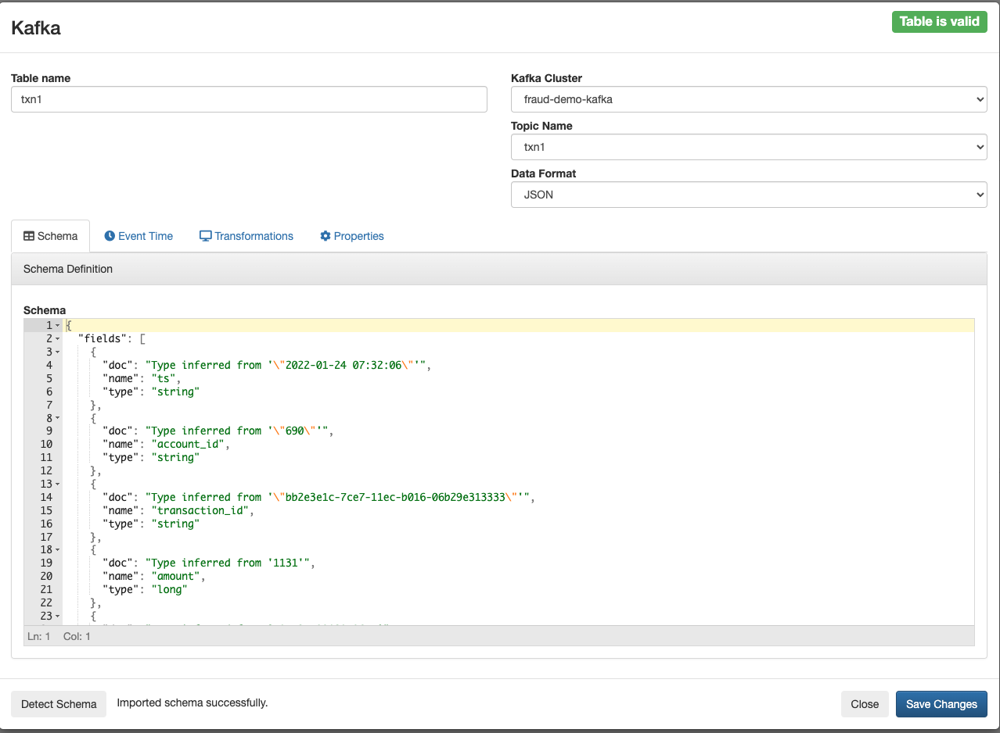

Make sure that you are using the Kafka timestamps and rename the "Event Time Column" to `event_time`

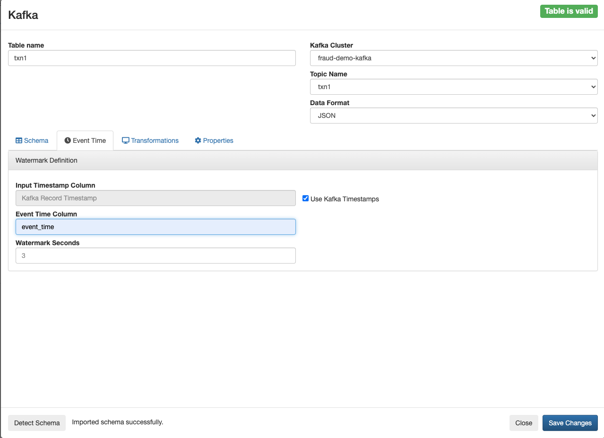

This creates a table called `txn1` that points to events inside the txn1 Kafka topic. These events are in JSON format. It also defines an event_time field which is computed from the Apache Kafka Timestamps and defines a watermark of 3 seconds. Similarly, we need to create a `txn2` table before using them in SSB.

We are ready to query our tables: `SELECT * FROM txn1`. It’s as easy as querying data in a SQL database.
Here’s how this looks like in the SSB console. Events are continuously consumed from Apache Kafka and printed in the UI:

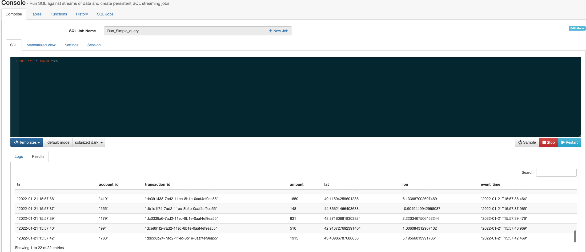

### Stream to Stream Joins

Remember, the objective here is to detect fraudulent transactions matching the following pattern, We will consider two transactions with the same "account_id" :

*** Occurring in 2 different locations,
*** With a distance greater than *1 KM*,
*** And with less than 10 minutes between them.

To do so, let's first join the `txn1` and `txn2` streams on attribute `transaction_id`:

[source,sql]
----
SELECT
       txn1.ts as EVENT_TIME,
       txn2.ts,
       txn1.account_id as ACCOUNT_ID,
       txn1.transaction_id AS TRANSACTION_ID,
       txn2.transaction_id,
       txn1.amount as AMOUNT,
       txn1.lat AS LAT,
       txn1.lon AS LON

FROM  txn1
INNER JOIN  txn2
on txn1.account_id=txn2.account_id
----
The output from SSB console:

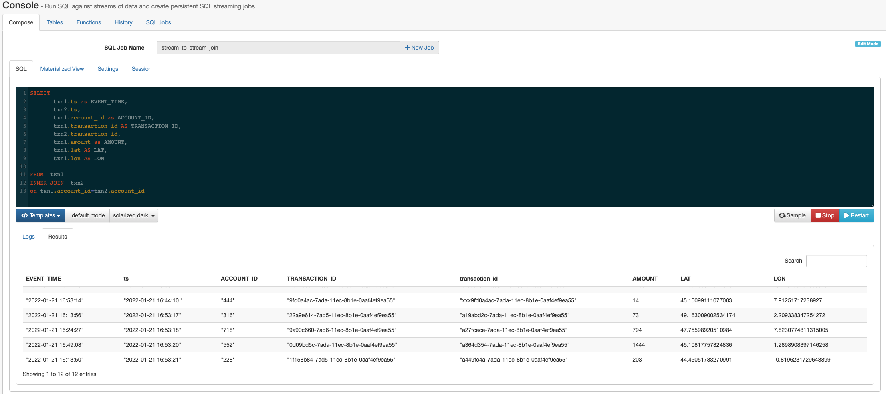

Now, we need to filter out :

** The events with the same location,
** The same events that match to self,
** With a distance between 2 locations less than 1KM,
** Within an interval of 10 minutes,
** Remember, the fraudulent transactions have a prefix of 'xxx'.

With SSB, we can create user functions (UDFs) to write functions in JavaScript. Since, there is no out-of-the box function in SSB to calculate the distance between 2 locations, let's use the UDF feature in order to enhance the functionality of our query. More details on UDF are available link:https://docs.cloudera.com/csa/1.6.1/ssb-using-js-functions/topics/csa-ssb-creating-js-functions.html[here]

The Javascript function will use the link:https://en.wikipedia.org/wiki/Haversine_formula[Haversine_formula]

[source,sql]
----
// Haversine distance calculator

function HAVETOKM(lat1,lon1,lat2,lon2) {
function toRad(x) {
return x * Math.PI / 180;
}

  var R = 6371; // km
  var x1 = lat2 - lat1;
  var dLat = toRad(x1);
  var x2 = lon2 - lon1;
  var dLon = toRad(x2)
  var a = Math.sin(dLat / 2) * Math.sin(dLat / 2) +
    Math.cos(toRad(lat1)) * Math.cos(toRad(lat2)) *
    Math.sin(dLon / 2) * Math.sin(dLon / 2);
  var c = 2 * Math.atan2(Math.sqrt(a), Math.sqrt(1 - a));
  var d = R * c;

  // convert to string
  return (d).toFixed(2).toString();
}
HAVETOKM($p0, $p1, $p2, $p3);
----

From SSB Console :

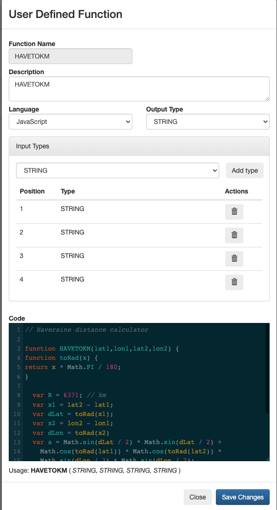

Now, let's run our query that implements our pattern :
[source,sql]
----
SELECT
      txn1.ts as EVENT_TIME,
      txn2.ts,
      txn1.account_id as ACCOUNT_ID,
      txn1.transaction_id AS TRANSACTION_ID,
      txn2.transaction_id,
      txn1.amount as AMOUNT,
      txn1.lat AS LAT,
      txn1.lon AS LON,
      HAVETOKM(cast (txn1.lat as string) , cast(txn1.lon as string) , cast(txn2.lat as string) , cast(txn2.lon as string)) as distance

FROM  txn1
INNER JOIN  txn2
      on txn1.account_id=txn2.account_id
where
      txn1.transaction_id <> txn2.transaction_id
      AND (txn1.lat <> txn2.lat OR txn1.lon <> txn2.lon)
      AND txn1.ts < txn2.ts
      AND HAVETOKM(cast (txn1.lat as string) , cast(txn1.lon as string) , cast(txn2.lat as string) , cast(txn2.lon as string)) > 1
      AND txn2.event_time  BETWEEN txn1.event_time - INTERVAL '10' MINUTE AND txn1.event_time
----

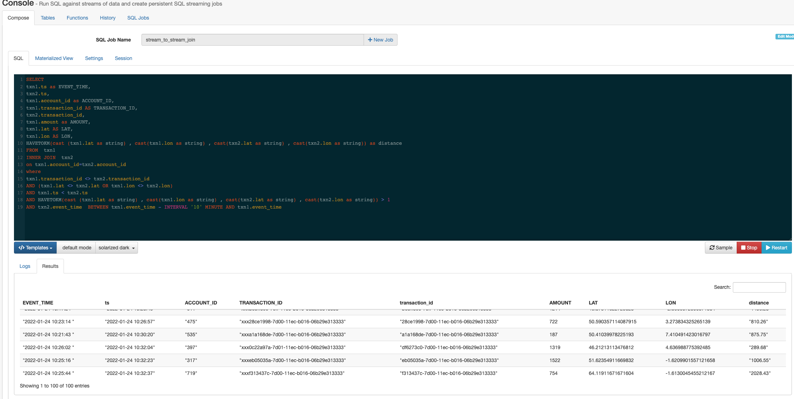

### Stream to Stream Joins and enrichment

In the previous paragraph, we have taken an inbound stream of events and used SSB to detect transactions that look potentially fraudulent. However, we only have account_id, transaction_id and location attributes. Not really useful. We can enrich these transactions by joining the previous results with some metadata information like username, firstname,address,phone from the "customer" Apache Kudu table. We will write back the results in another Apache Kudu table called "fraudulent_txn".

SQL Stream Builder can also take keyed snapshots of the data stream and make that available through a REST interface in the form of Materialized Views. We will define an MV before running the query :

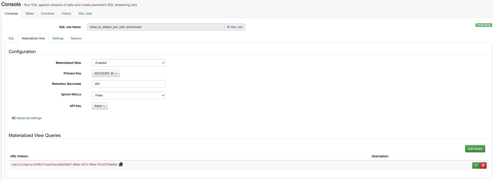

Now, let's run the query :

[source,sql]
----
INSERT INTO `fraud-detection-kudu`.`default_database`.`impala::default.fraudulent_txn`

SELECT EVENT_TIME,ACCOUNT_ID,TRANSACTION_ID, cus.f_name as FIRST_NAME ,cus.l_name as LAST_NAME,cus.email as EMAIL ,cus.gender as GENDER, cus.phone as PHONE , cus.card as CARD , LAT, LON, AMOUNT

FROM (
SELECT
      txn1.ts as EVENT_TIME,
      txn2.ts,
      txn1.account_id as ACCOUNT_ID,
      txn1.transaction_id AS TRANSACTION_ID,
      txn2.transaction_id,
      txn1.amount as AMOUNT,
      txn1.lat AS LAT,
      txn1.lon AS LON,
      HAVETOKM(cast (txn1.lat as string) , cast(txn1.lon as string) , cast(txn2.lat as string) , cast(txn2.lon as string)) as distance

FROM  txn1
INNER JOIN  txn2
      on txn1.account_id=txn2.account_id
where
      txn1.transaction_id <> txn2.transaction_id
      AND (txn1.lat <> txn2.lat OR txn1.lon <> txn2.lon)
      AND txn1.ts < txn2.ts
      AND HAVETOKM(cast (txn1.lat as string) , cast(txn1.lon as string) , cast(txn2.lat as string) , cast(txn2.lon as string)) > 1
      AND txn2.event_time  BETWEEN txn1.event_time - INTERVAL '10' MINUTE AND txn1.event_time
) FRAUD
JOIN  `fraud-detection-kudu`.`default_database`.`impala::default.customers` cus
      ON cus.acc_id = FRAUD.ACCOUNT_ID

----

We can see from the output that all the fraudulent transactions are displayed in the SSB console.

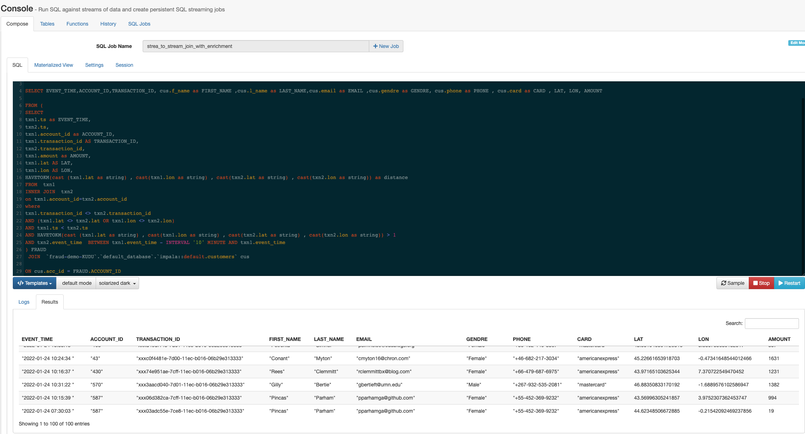

From Hue, we can see that the results are written to the Apache Kudu table :

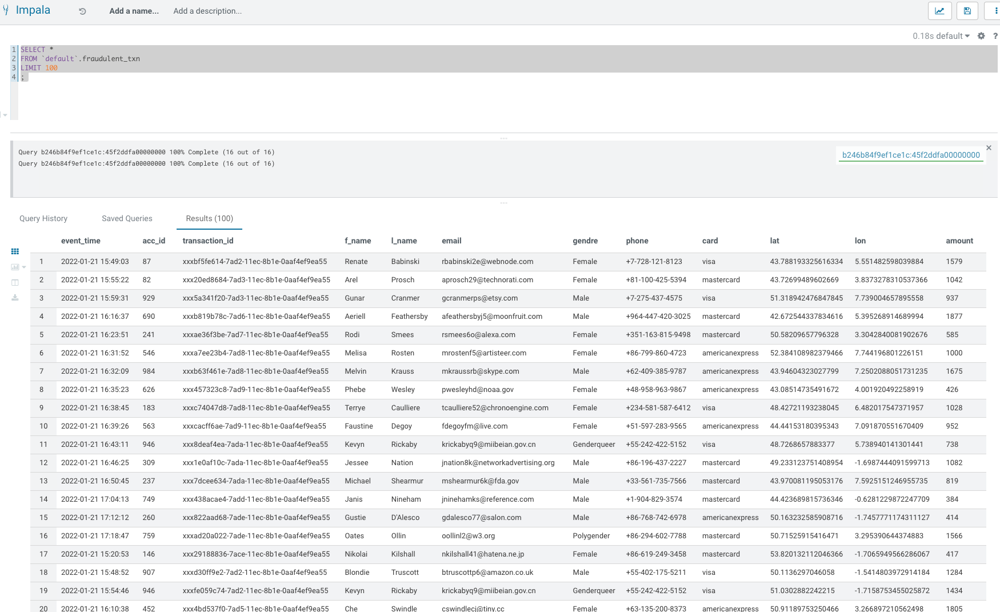

## Data Visualization

So far, using the above SSB application, we've got an Apache kudu table called "fraudulent_txn" being populated with fraudulent transactions. Now, let's complete our data life cycle with fancy visualizations with Cloudera Data Visualization.

Data Visualization in CDP Public Cloud enables you to explore data and communicate insights across the whole data lifecycle by using visual objects.

CDP Data Visualization is integrated with Cloudera Machine Learning (CML) and Cloudera Data Warehousing (CDW) workflows. For our fraud detection application, we will deploy the CDP Data Visualization application in CML.

First, we need to create a project called `Fraud-Data-Viz`. Then, we need to create an application `fraud-demo-data-viz`.
More details on accessing Data Visualization with CML can be found in link:https://docs.cloudera.com/data-visualization/cloud/start-cml/topics/viz-access-cml-runtime.html[Data Visualization public documentation]

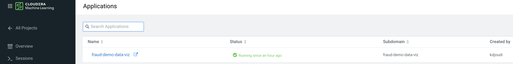

### Setting Up the data source in CDP Data Visualization

Data Visualization allows creating connections to many types of external data sources. In our case, we need to make a connection from CDP Data Visualization to Impala/Kudu tables in `Fraud-Demo-RTDW` DataHub.

To do so, we need to extract some parameters from the JDBC connection string in the "Endpoints" tab in DataHub. In our case :

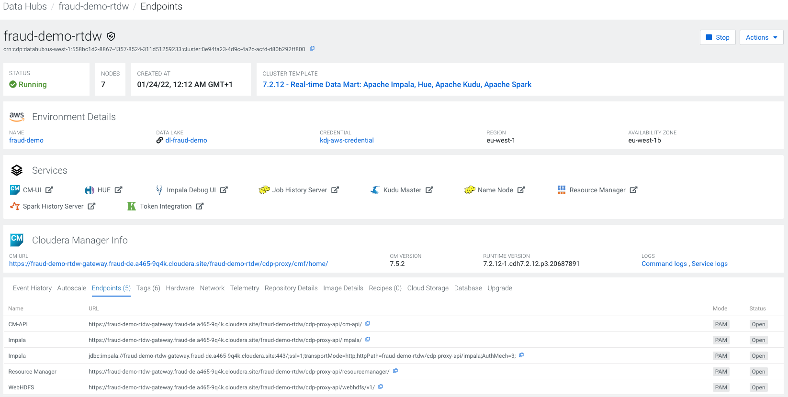

From the Impala jdbc connection string :
[source,sql]
----
jdbc:impala://fraud-demo-rtdw-gateway.fraud-de.a465-9q4k.cloudera.site:443/;ssl=1;transportMode=http;httpPath=fraud-demo-rtdw/cdp-proxy-api/impala;AuthMech=3;
----

we need to extract the following :
[source,sql]
----
hostname  = fraud-demo-rtdw-gateway.fraud-de.a465-9q4k.cloudera.site
httpPath = fraud-demo-rtdw/cdp-proxy-api/impala
----

Back to Data Visualization, from the "DATA" interface, click "NEW CONNECTION" and make sure to add the following parameters :

** Hostname or Ip address from the jdbc connection string,
** port = 443,
** Workload manager username and password,
** HTTP Path= fraud-demo-rtdw/cdp-proxy-api/impala.

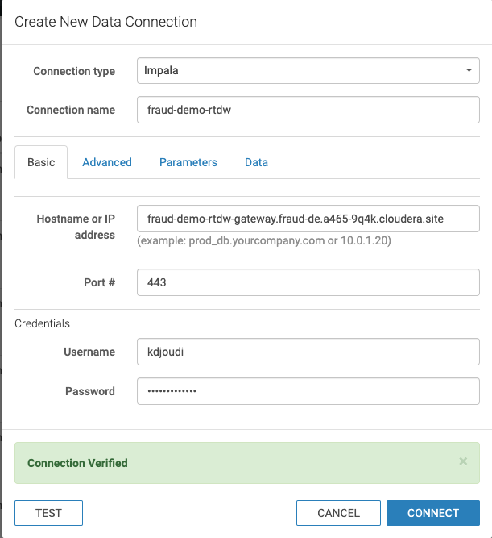

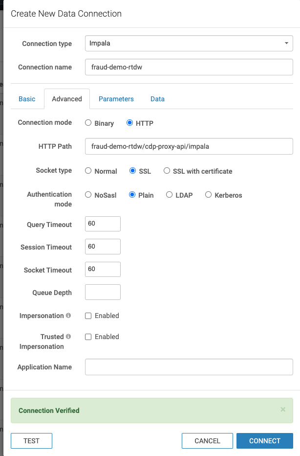

Now, we have Data Visualization connected to Impala/Kudu.

Now we can start creating our own Dashboards. I've already created a Dashboard and an application called "Fraud-Demo" and exported it as a template.
You can find this template in link:Templates/02_Fraud_Demo_Data_viz_Dashboard.json[`Templates/02_Fraud_Demo_Data_viz_Dashboard.json`]

After importing the template, we can see the following Dashboard and Application:

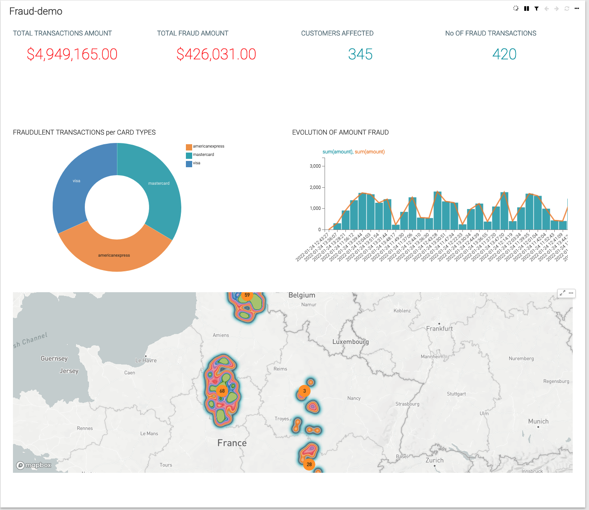

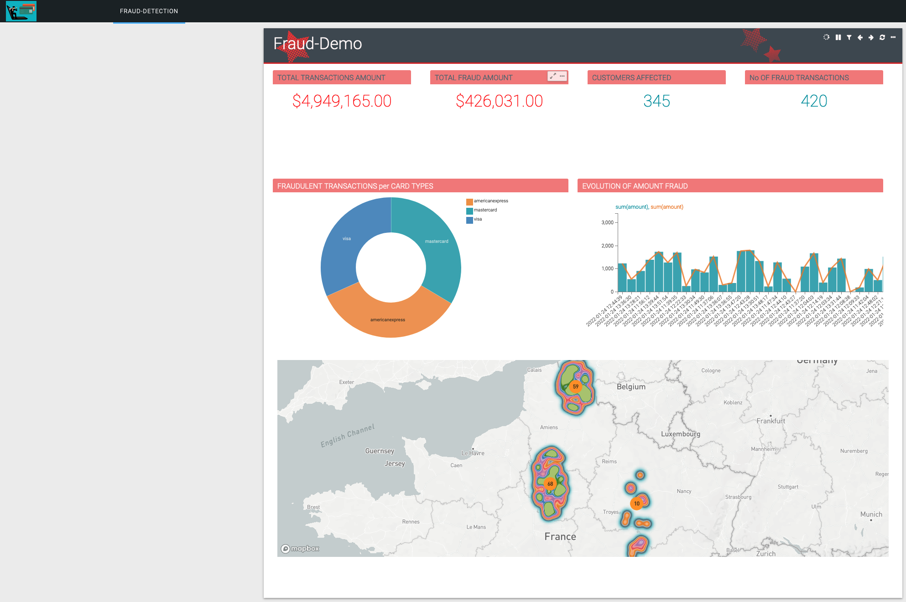

## Conclusion

In this article, we showed how we can build an advanced event-driven stream application, processing and exposing real-time data with no line of code using a very user-friendly UI of SQL Stream Builder.

We also showed the power of Flink providing advanced stream operations like streaming joins and windowing with the simplicity of SQL language with SSB. Now, building an advanced real-time stream process application has  become accessible to everyone.

All these tools are part of the Cloudera Data Flow stack for event streaming use cases.

Thanks for reading this far. As always, feedback and suggestions are welcome.

## References
[1]: https://www.cloudera.com/solutions/financial-services/fraud-prevention-resource-kit.html

[2]: https://docs.cloudera.com/csa/1.6.1/ssb-creating-tables/topics/csa-ssb-using-tables.html